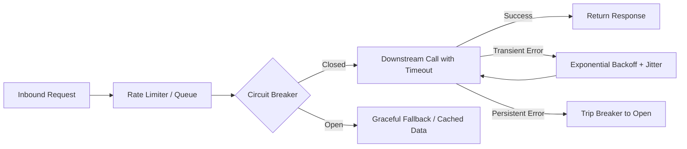

# Resilience & Observability Skill

This skill guides engineers and coding agents in building fault-tolerant, observable microservices capable of withstanding massive on-sale load spikes and downstream system outages.

---

## 1. Resilience Patterns: Catalog & Implementation

Every distributed network call is an inherent failure point. Microservices in Ticket D-Saster must actively defend themselves using the following patterns:

### 1.1 Timeouts (Mandatory on Every I/O Call)
- Never allow unbounded HTTP requests or database queries.
- Default HTTP Client timeout: `connectTimeout = 1000ms`, `readTimeout = 3000ms`.

### 1.2 Retries with Exponential Backoff and Full Jitter
- **Rule**: Only retry **transient errors** (e.g. HTTP 503 Service Unavailable, connection resets).
- **Idempotency Rule**: Never retry a mutating operation (`POST` or `PUT`) unless the endpoint supports an `Idempotency-Key` header.
- Formula:
  $$\text{sleep} = \text{random}(0, \min(M, T_{\text{base}} \times 2^{\text{attempt}}))$$
  *Adding jitter prevents "thundering herds" that crash recovering backends.*

### 1.3 Circuit Breaker (Fails Fast During Outages)
- When failure rate to an external provider exceeds a threshold (e.g. 50% over 10 seconds), the circuit trips to **OPEN**.
- While OPEN, incoming calls immediately fail or return a fallback without waiting on downstream timeouts.
- Periodically transition to **HALF-OPEN** to test if downstream has recovered.

### 1.4 Graceful Degradation
- If the Email System fails, seat purchase and ticket generation **must succeed**. Queue the email notification in a dead-letter queue.
- If the Search Indexer lags behind, serve cached event listings while indicating staleness.

*(See `references/resilience-patterns-checklist.md` for code examples in Spring Boot Resilience4j, Node.js Polly/bcircuit, and Python).*

---

## 2. Observability Telemetry & Standards

### 2.1 The Three Telemetry Signals
1. **Metrics (Prometheus)**: Numerical counters, gauges, and histograms.
2. **Logs (Loki)**: JSON-structured log lines indexed by stream labels.
3. **Traces (OpenTelemetry)**: Distributed request traces spanning microservice boundaries using standard `traceparent` headers.

### 2.2 Golden Signals to Measure
- **Latency**: Measure request durations in percentiles (p50, p95, p99). Never rely on averages.
- **Traffic**: Inbound requests per second (RPS).
- **Errors**: Ratio of HTTP 5xx responses against total requests.
- **Saturation**: Memory consumption, CPU utilization, thread pool usage, connection pool exhaustion.

### 2.3 Health Checks: Liveness vs. Readiness
Satisfies **Prerequisite 11**:
- **Liveness (`/health` or `/live`)**: "Is this process running and responsive?" Fails only when process is deadlocked or out of memory. If liveness fails, Docker/orchestrator restarts the container.
- **Readiness (`/ready`)**: "Can this instance serve traffic right now?" Fails if database or broker is unreachable. If readiness fails, Traefik temporarily pauses routing traffic to this replica **without restarting it**.

*(See `references/observability-standards.md` for Prometheus metric definitions and logging formats).*
