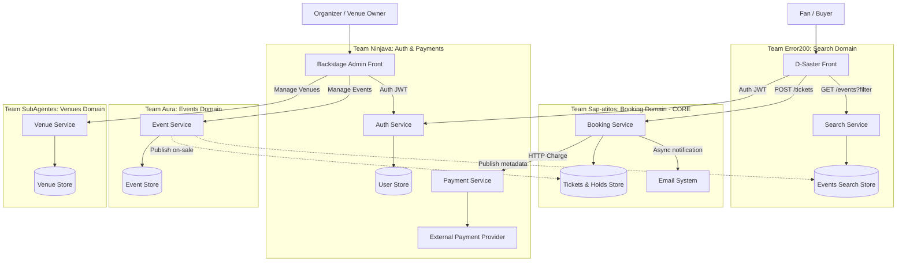

# Ticket D-Saster Architecture & Domain Knowledge Skill

This skill provides comprehensive architectural context and system design blueprints for the **Ticket D-Saster** high-concurrency event ticketing platform.

---

## 1. High-Level System Context (C4 Level 1)

Ticket D-Saster provides end-to-end ticketing, seating, and event management:
- **Actors**:
  - **Venue Owner**: Registers physical buildings, sections, rows, and seats.
  - **Organizer**: Publishes shows, assigns tier pricing, and schedules on-sale drop moments.
  - **Fan / Buyer**: Discovers events, views live seat maps, reserves seats, and completes purchases.
  - **Event Staff**: Gate checkpoints validating ticket QR codes.
- **External Systems**:
  - **External Payment Service**: Processes credit card transactions.
  - **Email Service**: Dispatches transactional tickets and confirmation QR codes.

---

## 2. Container Architecture & Team Ownership (C4 Level 2)

The system is partitioned into 5 independent microservice teams and 2 user-facing frontend applications:

*(See `references/c4-architecture-reference.md` for team topologies and communication contracts).*

---

## 3. High-Concurrency Seat Locking & Inventory Invariants

### 3.1 The At-Most-Once Booking Invariant
- **Rule**: Under no circumstances may two tickets exist for the same physical seat in an event.
- **Implementation Strategy**:
  - Use atomic reservation primitives in Redis (`SET seat:{eventId}:{seatId} holdToken NX EX 300`) or PostgreSQL row-level locks (`SELECT ... FOR UPDATE` with an active expiration timestamp check).
  - The hold window is **authoritative and server-side: 300 seconds (5 minutes)**. UI countdown timers are advisory only.
  - Expired holds are automatically reclaimed and returned to the pool without manual operator intervention.

### 3.2 Absorbing On-Sale Traffic Spikes (100k Concurrent Users)
- **Degrade to Virtual Queue**: When concurrent active hold requests exceed the processing capacity of the Booking Service or available seats are held, traffic degrades into a FIFO waiting queue.
- **Read/Write Seam**: Event discovery (`GET /events`, `GET /venues`) is completely decoupled from purchase (`POST /tickets/hold`, `POST /tickets/checkout`).
- **Read Cache**: Search and event catalog responses are aggressively cached with a max staleness of $\le 2\text{ s}$.

---

## 4. Domain-Driven Design (DDD) Subdomains

| Subdomain | Nature | Key Aggregates & Entities |
|---|---|---|
| **Sales / Booking** | **Core Domain** | `Ticket`, `SeatHold`, `CheckoutSession`, `WaitingQueue`, `Reservation` |
| **Search** | **Generic Subdomain** | `EventSearchProjection`, `VenueSummary`, `ArtistIndex` |
| **Event Management** | **Generic Subdomain** | `Event`, `SeatCategory`, `PriceTier`, `OnSaleSchedule` |
| **Venue Management** | **Generic Subdomain** | `Venue`, `Section`, `Row`, `PhysicalSeat`, `SeatMapGeometry` |
| **Auth / User Mgmt** | **Supporting Subdomain** | `User`, `Role`, `Credential`, `TenantContext` |
| **Payments** | **Supporting Subdomain** | `PaymentTransaction`, `PaymentMethodToken`, `Receipt` |

*(See `references/domain-model-matrix.md` for entity attributes and lifecycle state transitions).*
