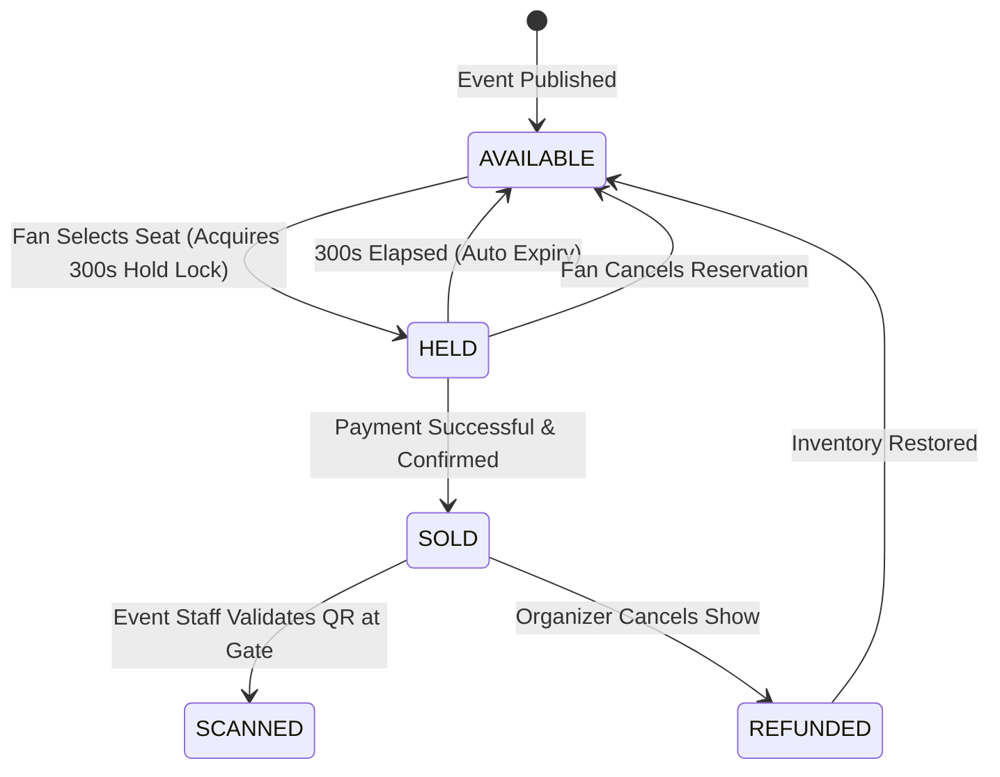

# Domain Model & Entity CRUD Matrix

This document defines the core Domain-Driven Design (DDD) entities, value objects, and lifecycle states for Ticket D-Saster.

---

## 1. Domain Entities & Value Objects

| Entity / Aggregate | Domain | Type | Key Attributes | Invariants |
|---|---|---|---|---|
| **`Venue`** | Venues | Aggregate Root | `id`, `name`, `location`, `capacity`, `sections` | Must contain at least one section. |
| **`PhysicalSeat`** | Venues | Entity | `id`, `section`, `row`, `number`, `coordinates` | Coordinate pair $(x, y)$ unique per section. |
| **`Event`** | Events | Aggregate Root | `id`, `venueId`, `artist`, `startDateTime`, `onSaleInstant`, `status` | `onSaleInstant` must precede `startDateTime`. |
| **`SeatCategory`** | Events | Value Object | `name` (e.g. VIP, General), `price`, `colorCode` | Price must be positive non-zero. |
| **`SeatHold`** | Booking | Aggregate Root | `holdToken`, `eventId`, `seatId`, `userId`, `expiresAt`, `status` | Lifetime strictly 300s. Cannot hold sold seat. |
| **`Ticket`** | Booking | Aggregate Root | `id`, `eventId`, `seatId`, `userId`, `qrCode`, `purchasedAt` | Exactly one valid ticket per (eventId, seatId). |
| **`PaymentTransaction`**| Payments | Aggregate Root | `id`, `holdToken`, `amount`, `status`, `idempotencyKey` | Idempotent on `idempotencyKey`. |

---

## 2. Seat Lifecycle State Machine

---

## 3. CRUD Matrix Across Microservices

| Entity | `venue-service` | `event-service` | `booking-service` | `search-service` | `auth-service` | `payment-service` |
|---|---|---|---|---|---|---|
| **Venue** | **CRUD** | Read | Read | Read | - | - |
| **PhysicalSeat**| **CRUD** | Read | Read | - | - | - |
| **Event** | - | **CRUD** | Read | Read | - | - |
| **PriceTier** | - | **CRUD** | Read | Read | - | - |
| **SeatHold** | - | - | **CRUD** | Read | - | Read |
| **Ticket** | - | - | **CRUD** | - | - | Read |
| **User** | - | - | Read | - | **CRUD** | Read |
| **Payment** | - | - | Read | - | - | **CRUD** |
