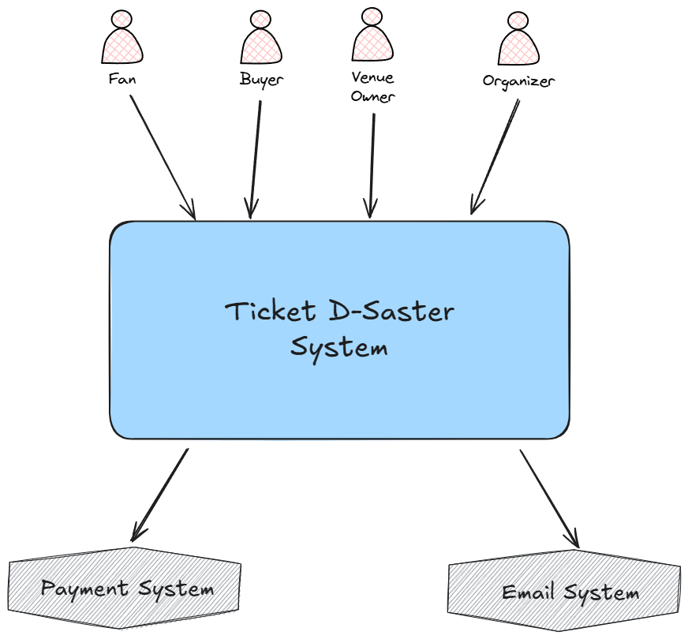
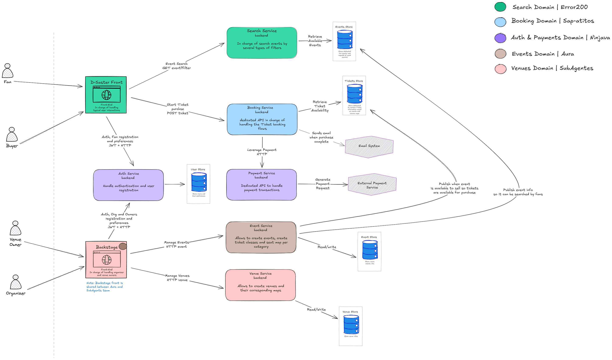
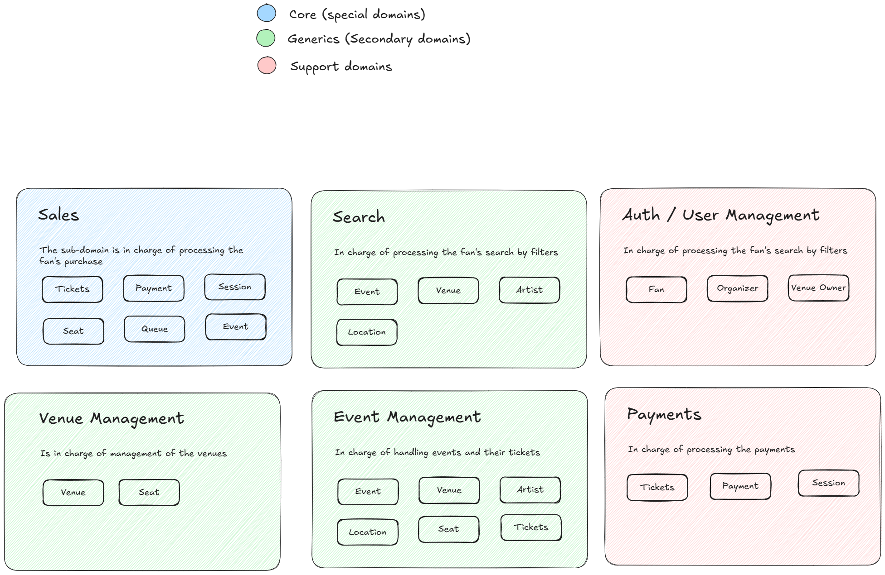

# System Architecture & Technical Topology

This document describes the architectural blueprints and domain classifications of the **Ticket D-Saster** platform based on the authoritative diagrams located in [`diagrams/`](./diagrams/).

---

## 1. High-Level System Context (C4 Level 1)

The C4 Level 1 diagram illustrates the boundary of the Ticket D-Saster system, the human actors interacting with it, and the external third-party software systems it integrates with.

### 1.1 Diagram Walkthrough & Actors
- **Core System**:
  - **Ticket D-Saster System**: The central software platform responsible for cataloging venues and events, managing seating inventories, processing reservations, handling authentication, and orchestrating ticket sales.
- **Human Actors**:
  - **Fan**: Public visitor who browses events, explores seating maps, and reserves seats.
  - **Buyer**: Person executing the checkout and financial transaction to purchase held tickets.
  - **Venue Owner**: Business partner responsible for registering physical buildings, updating seating sections, and maintaining accurate venue layouts.
  - **Organizer**: Event creator who publishes shows on top of existing venues, configures seat categories and ticket prices, and defines on-sale launch times.
- **External Systems**:
  - **Payment System**: External financial provider responsible for executing credit card transactions and returning payment confirmation tokens.
  - **Email System**: External communication infrastructure responsible for asynchronously delivering transactional emails, purchase receipts, and ticket QR codes.

---

## 2. Container Architecture & Microservice Teams (C4 Level 2)

The C4 Level 2 diagram depicts the internal container decomposition of the Ticket D-Saster system, illustrating frontend applications, backend microservices, datastores, and team boundaries.

### 2.1 User-Facing Frontend Applications
1. **D-Saster Front** (`Front-End`):
   - Handles public fan and buyer interactions.
   - Interfaces with `Search Service` via `GET event?filter` for discovery.
   - Interfaces with `Booking Service` via `POST ticket` to initiate reservations and purchases.
   - Interfaces with `Auth Service` via `JWT + HTTP` for authentication and fan registration.
2. **Backstage** (`Front-End`):
   - Dedicated administrative web portal for platform partners (Venue Owners and Organizers).
   - Co-owned and shared between Team **Aura** and Team **SubAgentes**.
   - Interfaces with `Venue Service` via `HTTP venue` to manage physical venues.
   - Interfaces with `Event Service` via `HTTP event` to manage events and pricing.
   - Interfaces with `Auth Service` via `JWT + HTTP` for partner login and role enforcement.

### 2.2 Microservice Teams, Backend Services & Data Stores
The backend is partitioned into five distinct engineering teams, each owning specific bounded services and isolated datastores:

| Domain & Team | Container / Service | Responsibilities & Protocol | Storage / Backing Resources |
|---|---|---|---|
| **Search Domain** `Error200` | **`Search Service`** *(backend)* | Handles event search queries across multiple filters (name, artist, venue, date, location). | **`Events Store`**: Specialized datastore optimized for rapid querying and indexing. |
| **Booking Domain** `Sap-atitos` | **`Booking Service`** *(backend)* | Dedicated API handling high-contention ticket reservations, 5-minute atomic seat holds, and purchase checkout workflows. Dispatches async email events to `Email System` upon purchase completion. Invokes `Payment Service` via HTTP. | **`Tickets Store`**: Authoritative store maintaining ticket inventory, seat availability states, and venue maps. |
| **Auth & Payments Domain** `Ninjava` | **`Auth Service`** *(backend)*  **`Payment Service`** *(backend)* | • `Auth Service`: Manages user credentials, partner identity, and issues signed JWTs. • `Payment Service`: Dedicated API handling payment transactions; generates requests to `External Payment Service`. | **`User Store`**: Persistent store holding user accounts and role definitions.  *(External Gateway)*: Integrates with external payment processors. |
| **Events Domain** `Aura` | **`Event Service`** *(backend)* | Allows creation and scheduling of events, setting ticket classes, and pricing per seat category. When an event is published for sale, it publishes event info to the `Tickets Store` (to enable purchasing) and the `Events Store` (to enable searching). | **`Event Store`**: Read/write datastore storing event entities, schedules, and pricing matrices. |
| **Venues Domain** `SubAgentes` **(⭐ OUR TEAM & SERVICE)** | **`Venue Service`** *(backend)* | Manages physical venue registrations, section polygons, rows, and seat map geometry. Provides venue catalogue endpoints for organizers and search indexers. | **`Venue Store`**: Read/write datastore storing physical venue records and seat layouts. |

---

## 3. Domain-Driven Design (DDD) Subdomain Classification

The domain model diagram establishes the strategic Domain-Driven Design classification, categorizing the problem space into Core, Generic, and Supporting subdomains.

### 3.1 Core Domains (Special Domains)
Core subdomains provide the primary competitive advantage and highest business value for the platform:
- **Sales Subdomain**:
  - Responsible for processing the fan's ticket reservations, locking seats under contention, managing the 5-minute hold timer, and orchestrating purchase completion.
  - Key Entities & Aggregates: `Tickets`, `Payment`, `Session`, `Seat`, `Queue`, `Event`.

### 3.2 Generic Domains (Secondary Domains)
Generic subdomains are essential for operation but follow standard, reusable industry patterns:
- **Search Subdomain**:
  - Responsible for filtering and querying available events.
  - Entities: `Event`, `Venue`, `Artist`, `Location`.
- **Venue Management Subdomain**:
  - Responsible for the physical definition and maintenance of venue locations and seating grids.
  - Entities: `Venue`, `Seat`.
- **Event Management Subdomain**:
  - Responsible for scheduling shows, assigning tier prices, and managing on-sale drops.
  - Entities: `Event`, `Venue`, `Artist`, `Location`, `Seat`, `Tickets`.

### 3.3 Supporting Domains
Supporting subdomains complement the core system with specialized operational capabilities:
- **Auth / User Management Subdomain**:
  - Handles partner invitation validation, role-based access control, user identity, and session tokens.
  - Entities: `Fan`, `Organizer`, `Venue Owner`.
- **Payments Subdomain**:
  - Responsible for processing financial transactions, managing idempotency, and interfacing with payment gateways.
  - Entities: `Tickets`, `Payment`, `Session`.

---

## 4. Architectural Stability Notice

> [!NOTE]
> The architecture documented here represents the **stable, foundational target topology** of the system. While services evolve incrementally across MVP iterations, the bounded contexts, container boundaries, and team assignments documented in this folder remain the authoritative baseline.
