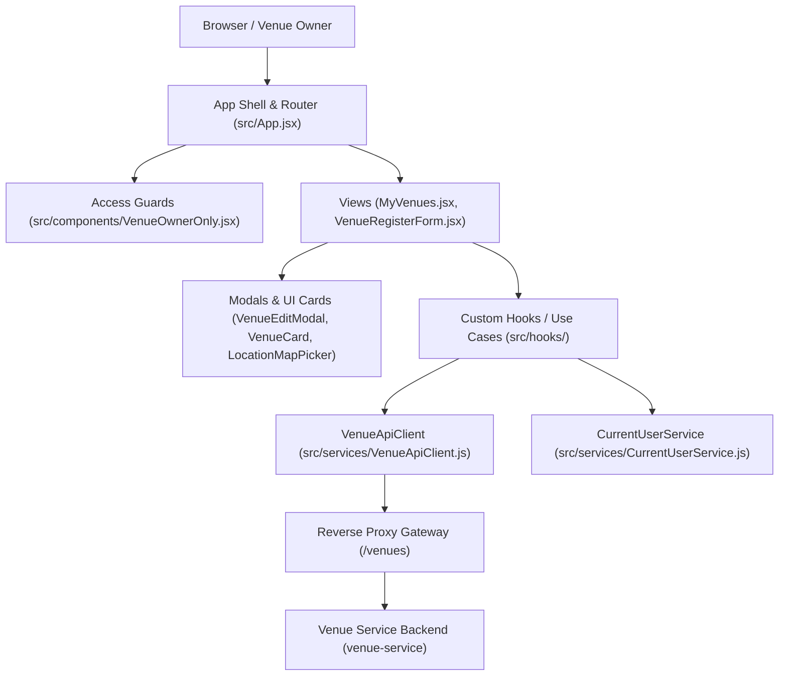

# Architecture & Domain Design

This document details the architectural principles, container boundaries, and source code organization of `venues-front`.

---

## 1. Domain Overview

The `venues-front` application is the partner-facing client for the **Venues Domain** within the Ticket D-Saster platform:
- Serves as the web frontend for Venue Owners integrated into the partner administration portal (`Backstage`).
- Enables Venue Owners to register physical spaces, maintain metadata, edit venue profiles, and select geographical coordinates on an interactive map.
- Consumes the venue catalogue and registration endpoints exposed by `venue-service` (Team SubAgentes).

---

## 2. Layered Component-Based Architecture

The codebase strictly decouples UI presentation, client application workflows/state, and network infrastructure into distinct layers.

### Layer Responsibilities

- **Presentation Layer (`src/components/`, `src/App.jsx`)**:
  Contains functional React components, modal dialogs, and visual cards. Responsible exclusively for rendering views, handling user interactions, accessibility, and client-side routing via native `popstate` events. Includes role-based guard wrappers (`VenueOwnerOnly`) and interactive map pickers (`LocationMapPicker` with Leaflet). Does not perform direct `fetch` calls.

- **Application Logic & State Layer (`src/hooks/`)**:
  Encapsulates use case workflows and asynchronous UI state machines. Custom hooks like `useCreateVenue` coordinate API execution, manage reactive state flags (`isLoading`, `isSuccess`, `isError`), and guard against race conditions using sequential request IDs (`requestIdRef`). `useCurrentUser` provides seamless subscription to session identity.

- **Infrastructure & API Services (`src/services/`)**:
  Encapsulates network communication and external HTTP endpoints (`VenueApiClient`). Maps REST responses and status codes into typed domain errors (`ApiClientError` differentiating 400 validation vs 403 authorization). Manages client-side session state via reactive in-memory stores (`CurrentUserService` using the Observer pattern).

---

## 3. Platform Integration & Gateway Routing

- **Gateway Routing**: Communicates with the platform backend through the Traefik gateway (`https://gateway.tail9a6ddb.ts.net/venues`) or local development proxies (`VITE_API_BASE_URL`).
- **Identity & Role Enforcement**: Consumes user identity provided by the authentication context (`venue_owner` role). Request payloads never transmit client-supplied `ownerId` values; backend token claims (`sub`) remain authoritative, while client guards enforce UI-level access control.
- **Backstage Subpath Integration**: Designed to operate within the shared Backstage partner portal co-owned with Team Aura.
